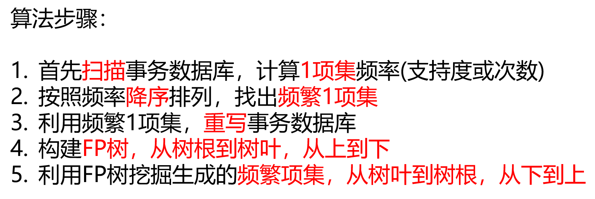
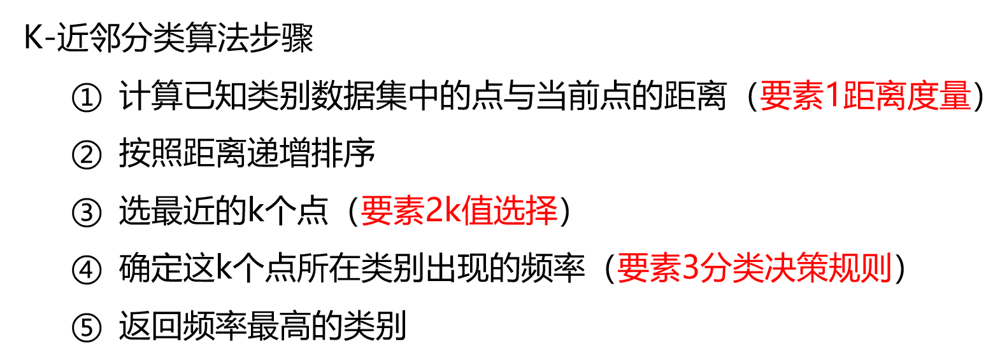
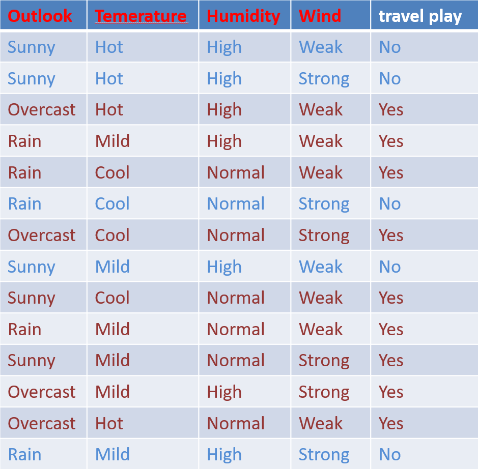

# 数据挖掘与应用
> Author：刘方磊、陈子谦
>
> Date：2023.11.3

- 试卷组成：选择题 30 道、判断题 10 道，简答题 3 道，代码题 1 道
- 选择判断每个 1 分，简答代码每个 15 分。本文档大部分内容是为了选择、判断题服务
- 已知代码基本是固定写法，在本文档第六章有通用框架；简答有一个必考 Apriori / FP-Growth 案例
- 其余简答题重点看课后作业和优缺点，以及文档中有醒目标注（如加粗，标记等）的地方

## 一、数据挖掘基础

1. ### 什么是数据挖掘

- 数据挖掘是一个自动化的过程，从大量不完整，有噪音，不均衡等数据中，抽取有趣的和有用的隐含模式
- 但有时候它也不是一个完全自动化的过程，有时需要人为干涉，比如需要领域知识，数据收集和数据预处理等
- 数据挖掘的别称是知识发现

1. ### 数据挖掘的场景

#### A. 分类问题

- 分类是一种过程，对已知的数据进行学习，为新的数据标注一个类别
- 常见分类算法：决策树、K近邻、神经网络、支持向量机

#### B. 聚类问题

- 聚类自动将相似对象分组到集合中，比较适合一些不确定的场景
- 距离指标：欧式距离、曼哈顿距离、马氏距离
- 常见算法：K-Means、层次聚类
- **分类是监督学习，聚类是无监督学习**
- 分类算法一般基于概率（也有例外，如SVM），聚类算法一般基于距离

#### C. 关联规则

- 关联规则挖掘可以从数据集中发现项与项之间的关系

#### D. 回归问题

- 预测与对象相关联的连续值属性
- 常见算法：线性回归、多项线性回归

1. ### 数据挖掘过程（主要记一下加粗部分）

- **业务理解**：理解数据挖掘要解决什么业务问题
- **数据理解**：在业务理解的基础上，对掌握数据要有一个清晰、明确的认识，确保数据和业务对齐
- **数据准备**：基于原始数据，去构建数据挖掘模型所需的数据集的所有工作。包括数据收集、数据清洗、数据补全、数据整合、数据转换、特征提取等一系列工作
- **构建模型**：选中各种各样的算法模型来处理数据，让模型学习数据的规律，并产出模型
- **评估模型**：模型的效果如何，能否满足业务需求
- **部署模型**：部署是一个项目的结束，进入线上维护阶段

## 二、数据挖掘工具

1. ### RapidMiner


- **RapidMiner 是一款数据挖掘平台，支持监督学习和无监督学习的建模任务（选择题）**

1. ### Scikit-Learn

- **Scikit-Learn是一个用于机器学习的 Python 库（选择题）**
- Sk-Learn 的一般使用步骤
  - 获取数据
  - 数据预处理
  - 模型训练、预测与评估
  - 保存模型
- 代码部分会放在第六章细讲

1. ### Matplotlib / Seaborn

#### A. Matplotlib

- 折线图用于显示数据在一个连续的时间间隔或时间跨度上的变化
- 散点图通过图上的数据分布情况，可以推断出变量间的相关性，注意相关性不代表因果性
- 散点图侧重于展示点之间的分布规律，而气泡图将数值映射到气泡的大小上，增加了一个维度的数据展示
- 柱状图使用垂直或者水平的柱子显示类别之间的数值比较
- 子图的三种创建方式：add_subplot()、pyplot、subplots

#### B. Seaborn

- **Seaborn绘图的五种主题风格（记住，包括英文！）**
  - **darkgrid: 灰色网格**
  - **whitegrid: 白色网格**
  - **dark: 黑色（灰色的底）**
  - **white: 白色**
  - **ticks: 十字叉（坐标上有刻度线）**
- **绘制每种图的两个方法（简答题可能会考！）**
  - **折线图：lineplot()、relplot(kind='line')**
  - **散点图：scatterplot()、relplot()**
  - **箱线图：boxplot()、catplot(kind='box')**
  - **计数图：countplot()、catplot(kind='count')**
- 调色盘
  - 默认调色盘
  - HLS 圆形颜色系统
  - 连续调色盘
  - 离散调色盘

1. ### Pandas

- 读取csv文件：read_csv()
- 保存csv文件：to_csv()
- 描述数据集：describe()
- 获取列名：columns()

## 三、关联规则

1. ### 基础概念

1. #### Kick Off

- 关联分析（关联规则）挖掘是无监督机器学习方法，目的是发现大规模数据集中的关联性和依存性
- 关联关系通常的表现形式如下
  - {事物A} => {事物B}
- 应用场景：在线广告推荐、用户行为分析等

1. #### 项、项集

- **接下来的所有分析将以这个表为例**

| 访问时段 | 新闻 | 财经 | 娱乐 | 体育 | 艺术 |
| -------- | ---- | ---- | ---- | ---- | ---- |
| 1        | 1    | 1    | 0    | 0    | 0    |
| 2        | 1    | 1    | 0    | 0    | 0    |
| 3        | 1    | 1    | 0    | 1    | 0    |
| 4        | 0    | 0    | 0    | 0    | 1    |
| 5        | 1    | 1    | 0    | 1    | 0    |
| 6        | 1    | 0    | 1    | 0    | 1    |

- 我们看到这个表记录了每个访问时段的浏览的新闻领域情况。**这里每个访问时段就是一个事务，每个领域都称为一个项；在一个事务中，多个项组成的集合叫做项集**
- 如果一个事件中包含了K个元素，那么这个事件就叫做K项集事件，比如
  - 项集{新闻}：一项集
  - 项集{新闻, 体育}：二项集
  - 项集{新闻, 娱乐, 艺术}：三项集

1. #### 支持度、置信度、提升度（重要！得会计算！）

- 某条规则的强弱主要是通过支持度与置信度来定量
- **支持度**
  - 支持度指的是一个项集出现的次数与总次数之间的比，比例越高，代表组合出现的频率越高
  - 比如在上表中，{新闻, 财经} 组合在六个访问时段（事务）中出现了 4 次，那么该组合的支持度就是 4/6，也就是 2/3
- **置信度**
  - 置信度就是访问了 X 项后，会有多大概率访问 Y 项
  - 置信度计算公式：置信度(X => Y) = 支持度(X U Y) / 支持度(X)
  - 举例：现在要计算置信度(新闻 => 财经)，那么就是支持度(新闻 U 财经) / 支持度(新闻)，就是支持度(新闻, 财经) / 支持度(新闻) = (2/3) / (5/6) = 4/5
- **提升度**
  - 提升度指访问 X 项对访问 Y 项的概率的提升程度。这个值为 1 时代表无变化；小于 1 时代表下降；大于 1 时代表提升
  - 提升度计算公式：提升度(X => Y) = 置信度(X => Y) / 支持度(Y)
  - 举例：现在要计算提升度({新闻,财经}=>{体育})，首先计算置信度({新闻,财经}=>{体育}) = 支持度(新闻,财经,体育)/支持度(新闻,财经)=(2/6)/(4/6)=1/2；再计算支持度(体育) = 1/3；得到提升度为 (1/2) / (1/3) = 3/2

1. #### 频繁项集

- 关联分析**最主要的目的就是寻找频繁项集**
- 频繁项集是指支持度大于等于最小支持度的项集。注意，这里的**最小支持度是人为设定的**
- 假定现在设置最小支持度为 0.5，{新闻, 财经} 组合的支持度为 2/3，那么它就是一个频繁项集
- **如果一个频繁项集 X 的任意一个****超集****都是非频繁项集，则称 X 是最大频繁项集**

1. #### 关联规则、强相关规则

- 生成关联规则的一般过程
  - 找出所有频繁项集
    - 需要设置合理阈值，最小支持度
    - 通过最小支持度找出所有频繁项集或最大频繁项集
  - 从高频项中提取规则
    - 需要设定合理的阈值，最小置信度
    - 利用频繁项集生成所需要的关联规则，利用最小置信度筛选出强关联规则
- **同时满足最小支持度阈值和最小置信度阈值的规则称为强关联规则（选择题）**

1. ### Apriori算法

1. #### 算法思想

- **目标：寻找最大的频繁 K 项集（选择题）**
- 实现：采用了迭代的方法，先搜索出候选 1 项集及对应的支持度，去掉低于最小支持度的 1 项集，得到频繁 1 项集。然后对剩下的频繁 1 项集进行连接，得到候选的 2 项集，去掉低于最小支持度的候选 2 项集，得到真正的频繁 2 项集，以此类推，直到无法找到频繁 K+1 项集为止，对应的频繁 K 项集的集合即为算法的输出结果
- 核心：
  - 如果某项集是频繁项集，那么它所含的全部子集也是频繁项集
  - 如果一个集合不是频繁项集，则它的所有超集都不是频繁项集

1. #### 算法过程（重要）


- 以该流程为例复习 Apriori 算法扫描过程（设定最小支持度为 0.5）


- 首先从事务数据库中整理出 1 项集


- 第一遍扫描，计算所有 1 项集的支持度，并筛选掉不满足最小支持度的项集（标红的部分）


- 对得到的频繁 1 项集进行排列组合得到 2 项集，进行第二次扫描得到频繁 2 项集


- 同理对得到的频繁 2 项集进行排列组合得到 3 项集，进行第三次扫描得到频繁 3 项集


- 得出的结果已经无法再进行 K+1 项集的构建，算法结束，得到最大频繁 3 项集


1. #### 算法缺点与改进

- 缺点
  - 产生大量的候选集，浪费空间
  - 每次计算都需要重新扫描数据集，每个项集都需要计算支持度，需要很大的 I/O 负载，浪费时间
- 改进思路：
  - 基于数据分割（Partition）的方法
  - 基于散列（Hash）的方法

1. ### FP-Growth算法

1. #### 算法概念

- 该算法采用分而治之的基本思想，将数据库中的频繁项集压缩到一颗频繁模式树中，同时保持项集之间的关联关系，然后将这颗压缩后的频繁模式树分成一些条件子树，每个条件子树对应一个频繁项，从而获得频繁项集，最后进行关联规则挖掘
- FP-Growth 算法的平均效率远高于 Apriori 算法，但是它并不能保证高效率

1. #### 算法过程（重要）



- **首先我们假定最小支持度计数为2，****原始数据****如下图**


##### I. 扫描事务数据库，计算所有 1 项集频率


##### Ii. 对上一步的计算结果进行降序排序，筛选出频繁 1 项集


##### Iii. 基于上一步得出的结果，对原始数据进行重写，对每一个事务 (TID) 中的项按照频率降序重新排序


##### Iv. 构建 FP-Tree

- 基于上一步的结果，将非频繁项集去除后，得到以下结果


- 创建树的根节点，称之为null


- 对事务 001 (3, 1) 进行构建**（一定严格按照项排序的顺序，是 (3, 1) 那就先 3 再 1，下同）**


- 对事务 002 (2, 3, 5) 进行构建


- 对事务 003 (2, 3, 5, 1) 进行构建


- 重点来了，你可能会好奇，为什么不再新建一个分支呢？
- 构建 FP-Tree 时，比如对于上文的 事务 002 (2, 3, 5) 和 事务 003 (2, 3, 5, 1)，你会发现它俩有重复的路径，也就是 2, 3, 5，**那么在构建树时，对于路径相同的部分，就会合并到一起，同时对应的次数加一，对于不同的地方，就会进行延伸**
- 你也会发现树中的每个项的名称都是 (x, y) 格式，**其中 x 代表实际的项，y 代表这个项在这条分支中出现的次数**
- 以事务 002 和事务 003 为例，首先构建事务 002：(2:1), (3:1), (5:1)，接着构建事务003，既然这俩事务的前三项都一样，那么就对重复的路径进行合并，重复的是 2, 3 , 5，那么就把分支中对应的计数加一，也就是 (2:2), (3:2), (5:2)，接着事务 003 中有一个不重复的项 1，那么就在后面进行延伸，最后构建出了 (2:2), (3:2), (5:2), (1:1)，代表着这条路径中 2, 3, 5 这三个项各出现了 2 次，项 1 出现了 1 次
- **请务必理解这一段，后面还会用到**

- 对事务 004 (2, 5) 进行构建


- 现在我们已经成功对所有事务创建了分支

##### V. 创建项头表

- 对于每个项，在树中用节点链按照事务构建的顺序指向该项所在的位置


##### Vi. 构建条件 FP 树

- 找出每个项的条件模式基


如何找条件模式基？

- 我们以项 5 为例，寻找一下它的条件模式基
- 通俗点说，**条件模式基就是在** **FP** **树中，到达某个项的路径（不包括该项本身）**
- 首先根据左边表格，**项 5 一共出现了 3 次，这代表着有 3 条路径指向项 5，这很重要**
- 接下来我们分析树，我们观察到有两个**分支**包含 5，也就是 (2:3), (3:2), (5:2) 和 (2:3), (5:1)
- 对于前一个分支，在该分支中 5 出现了 2 次，**而在这两次到达 5 的路径中，2 和 3 分别出现了两次**，故项 5 的第一个条件模式基就是 {2 3:2}
- 对于后一个分支，5 出现了 1 次，说明有 1 条路径到达 5，且在该路径中 2 出现了 1 次，故它的第二个条件模式基是 {2:1}
- 注意不要被 (2:3) 所迷惑！**在分支中出现的次数和在到达某项的路径中出现的次数是两个概念**！
- 条件模式基不包括根节点null，所以你会发现 2 的条件模式基为空，3 的条件模式基只有 1 个

- 按照项频率从低到高的顺序 (频繁 1 项集那个)，对每个项的条件模式基中的元素，按照出现的频率从高到底低序，然后以此为根据构建每个项的条件 FP 树
  - 首先来看项 1 的条件模式基，观察到其中 3 出现了 2 次，2, 5 分别出现了 1 次，依据这个进行构建
  - 
  - 同理我们构建出其他项的条件 FP 树
    - 

##### Vii. 生成频繁项集

- 首先挑选出每个项的条件 FP 树中满足最小支持度的叶子节点（标红的地方）


- 结合每个项出现的次数，根据结果进行频繁项集的构建
  - 
  - 项 1 的条件树中，只有项 3 满足最小支持度条件，故可构建出频繁项集 {1 3:2}
  - 项 5 的树中，两个叶子节点均满足条件，则对其进行排列组合得到三个频繁项集 {{2 3 5:2}, {3 5:2}, {2 5:3}}
  - 项 3 的树中，只有项 2 满足条件，故得出频繁项集 {2 3:2}

## 四、回归方法

1. ### 线性回归

1. #### 基本概念

- 线性回归是一种统计学上的分析方法，用于研究**因变量**（目标变量）与**一个或多个**自变量（特征）之间的线性关系。线性回归的目标是找到一个线性方程（线性模型），该方程能够描述自变量与因变量之间的关系，并最小化预测误差


1. #### 一元和多元线性回归

- 一元线性回归是研究一个自变量和一个因变量之间的线性关系的方法
- 多元线性回归是研究多个自变量和一个因变量之间的线性关系的方法
- 最终求解的问题：选取合适的参数，使得所有样本的误差的平方和最小
- 误差计算公式：(评估值 - 真实值)²


1. #### 最小二乘法和梯度下降法

- 最小二乘法是一种常用的线性回归参数估计方法。它的目标是使预测误差（实际值与预测值之间的差）的平方和达到最小。通过最小二乘法，可以得到线性模型中的回归系数（a0、a1、...、an）
- 求解方法：通过求解正规方程或梯度下降法计算回归系数（ a0、a1、...、an ）
- 最小二乘法的优缺点
  - 优点：简洁、高效、方便
  - 缺点：需要计算逆矩阵；样本数量非常大时比较耗时
- 优化方法：梯度下降法

1. #### 正则化

- 正则化是一种模型优化方法，通过在损失函数中加入正则项（惩罚项）以控制模型复杂度，**防止****过拟合**
- **岭回归不能进行特征选择，Lasso 回归可以进行特征选择**


##### A. L1 正则化（Lasso 回归）

- 在损失函数中**加入参数的绝对值之和**，产生稀疏解，实现特征选择

##### B. L2 正则化（岭回归）

- 在损失函数中**加入参数的平方的和**，使参数接近于零但不为零，降低模型复杂度

1. ### 逻辑回归

1. #### 基本概念

- 逻辑回归是一种常用的**分类**算法，基于一个基础的线性模型并使用 **sigmoid** 函数将线性输出转化为概率值
- 输出函数值是连续值，无法得到离散的分类标签


1. #### 损失函数和极大似然估计


1. #### 优化方法

- 梯度下降法：基本思想是沿着损失函数的梯度方向迭代更新模型参数
- 牛顿法：通过二阶导数来近似损失函数的局部曲率，并更新模型参数
- 拟牛顿法：使用近似的 Hessian 矩阵来更新模型参数，从而避免了计算和存储二阶导数矩阵的代价

1. #### 多分类方式

- One-vs-All：使用多个二分类逻辑回归模型来实现，每个类别都建立一个二分类器，本类别标签定义为 1，其他分类标签定义为 0
- 多项式逻辑回归：直接建模多分类问题，使用 softmax 函数构造模型解决多分类问题，它将每个类别都看作一种事件，使用 softmax 函数将线性输出转换为各个类别的概率值

1. #### 评价指标

- 我们使用混淆矩阵来表示分类结果


- 注意几个公式，代码题已经有了所以理论留个印象就好


1. #### 逻辑回归模型构建流程

1. 数据清洗和异常值处理：缺失值、异常值、离群值处理，标准化和归一化
2. 数据集划分：简单随机划分，K折交叉验证，自助法
3. 特征选择：Filter、Wrapper，Embedded方法
4. 正则化：L1正则化，L2正则化
5. 交叉验证：简单交叉验证、K折交叉验证，留一交叉验证

## 五、分类方法

1. ### 概述

- 分类是一个数据挖掘技术，对数据进行分组和预测，将数据对象分配给预先定义的类别或标签
- 分类的类型
  - 二分类，比如垃圾邮件判断
  - 多分类：比如识别手写数字
  - 多标签分类：比如疾病分类
- 分类的两个步骤
  - 建立模型
  - 使用模型进行分类

1. ### 常用分类算法

1. ##### KNN（K-最近邻）

- 原理：通过计算待分类数据点与已知类别数据点之间的相似度（通常使用距离度量）来确定待分类数据点所属的类别
- 三要素
  - 距离度量
    - KNN算法中的距离度量用于衡量待分类数据点与训练样本之间的相似程度
    - 常用的距离度量方法：欧式距离、曼哈顿距离、切比雪夫距离
    - 
  - K值的选择
    - K值是 KNN 算法中的一个关键参数，它决定了用于投票的邻居数量
    - **较小的 K 值容易****过拟合****，较大的 K 值容易欠拟合**
  - 分类决策规则
    - 多数表决
    - 加权



- 优点（重要）
  - 简单易懂，无需训练过程
  - 对于输入数据的分布没有假设，适用于各种类型的数据
  - 可以很容易地处理多分类问题
- 缺点（重要）
  - 计算量较大，因为需要计算待分类数据点与每个训练样本之间的距离
  - 对于高维数据和大规模数据集效率较低
  - 敏感于噪声和离群点
  - 当数据不平衡时，可能导致分类偏向占优势的类别

1. ##### 决策树

###### I. 基本概念

- 每个决策或事件都可能引出两个或多个事件，导致不同的结果，把这种决策分支画成图形，像一颗树的枝干，故称“决策树”。它是一种监督学习方法
- 组成部分
  - 根节点：决策树的起始节点，表示整个数据集。从该节点开始，根据某个特征值的划分将数据集分为子集
  - 内部节点：决策树中间层的节点，表示数据集的一个子集，每个内部节点都与一个特征相关联
  - 叶节点：决策树的终端节点，不再进行数据分割，是决策树的预测结果
-  使用场景
  - 分类任务
  - 回归任务
- 模型构建过程
  - 特征选择
  - 决策树生成
  - 剪枝
    - 预剪枝（在构建过程中剪枝）
    - 后剪枝（在构建完成后剪枝）

###### Ii. ID3 算法

- ID3算法使用信息增益作为特征选择标准，通过递归的方式构建决策树，主要用于分类任务，它不进行剪枝
- 信息熵的定义


- **信息越不确定，****信息熵****越大；信息越确定，信息熵越小**
- 信息增益的计算：**信息增益 = 父节点的****熵**  **- Σ (子节点权重 \* 子节点熵)**
- 信息增益越大，说明特征对数据集的划分效果越好

案例计算（考的概率不大）

- 案例如下图，共 14 个样本，每一行记录着每一天的气候情况（特征）和当天是否出去玩（结果）



- 目标：根据这个数据集，依据 ID3 算法构建决策树，预测“是否出去玩”
- 第一步：计算数据集总信息量，根据结果进行划分。14个样本中有 9 个出去玩，5 个不出去玩，那么就可以计算总的信息熵


- 第二步：观察到数据有四个主要特征：Outlook（天气）、Temperature（温度）、Humidity（湿度）、Wind（风力），我们先对这四个特征进行分析，决定根节点
  - 以天气这个整体特征为例，根据公式列出它的信息增益计算式
  - 
  - 天气由三个子节点组成，分别是晴、雨、云，分别对应5个，5个，4个样本，对应的公式中的字节点权重，接下来来计算每个子节点的信息熵
  - 以晴天为例，晴天有 5 个样本，其中有 2 个是出去玩，3个是不出去玩，那么直接套公式算信息熵
  - 
  - 同理我们算出另外两个天气对应的信息熵
  - 
  - 代入公式得到天气整体特征的信息增益，同理算出其他特征的信息增益


- 天气特征的信息增益最大，故选择它作为根节点


- 第三步：开始选择内部节点，从晴天开始，计算剩余三个特征的信息增益，以温度为例，注意这里父节点已经变成了“晴”，故套公式时候要注意样本基数
  - 
  - 温度有 hot, mild, cool 这三个字节点，开始计算信息熵
  - 以 mild 为例，在晴天的样本中占两个，一个为 yes 一个为 no，那么它的信息熵是 1，其他两个的结果都是一致的，故信息熵为 0
  - 
  - 同理计算出其他两个，发现湿度的信息增益最大，故选择湿度作为晴天下的内部节点


- 以此类推，得到整个决策树


- ID3 的优缺点
  - 优点：实现简单，易于理解
  - 缺点
    - 只能处理离散特征，无法直接处理连续特征；对于连续特征，需要先进行离散化处理
    - 使用信息增益作为特征选择标准可能导致选择取值较多的特征，使得树过于复杂，可以通过使用信息增益率来解决这个问题
    - 容易产生过拟合，需要通过剪枝技术来降低过拟合风险
    - 不支持缺失值处理，需要在预处理阶段对缺失值进行处理

###### Iii. CART 算法

- CART 算法使用基尼指数作为特征选择标准，通过递归的方式构建决策树，可以同时处理分类和回归任务，生成二叉树结构。它采用后剪枝策略
- 优点


- 缺点


1. ##### 贝叶斯

- 贝叶斯和朴素贝叶斯的区别
  - 朴素贝叶斯是贝叶斯方法的一种特殊情况，它引入了条件概率独立性假设
  - 所以请注意，**贝叶斯（没有“朴素”哦）不一定满足条件独立性假设**
- 公式、先验概率、后验概率，似然概率


- 优缺点


1. ##### 支持向量机（SVM）

- 支持向量机是一类按监督学习方式对数据进行二元分类的广义线性分类器，其决策边界是对学习样本求解的最大边距超平面
- 算法思想
  - 先从线性可分样本集上学习如何画一条直线把它分开，之后把线性可分样本集上画直线的方法推广到线性不可分样本集上
  - 凡是画一条直线可以将两类样本进行分类的叫做线性可分样本集，否则叫线性不可分样本集
  - 支持向量机是最大化间隔的方法
- 对于线性不可分支持向量机，需要使用核函数将样本从原始空间映射到一个更高维的特质空间中，使得样本在新的空间中线性可分
  - 常用核函数
  - 
- 支持向量回归模型


1. ##### 感知机

- 感知机是二类分类的线性分类模型，其输入为实例的特征向量，输出为实例的类别。目的是求出将训练数据进行线性划分的分离超平面。它是一个监督学习算法
- 结构：输入层（接收多个输入信号）、输出层（输出一个信号），如图所示


- 以上图为例，解释单层感知机运行原理


- 单层感知机的简单应用：与门、与非门、或门。它们具有相同的感知机结构，区别在于权重和阈值不同
- **单层****感知机****只能解决线性分类问题，无法实现****异或****门这样的非线性问题（判断题）**
- **单层****感知机****叠加后可以变成****多层感知机****，就可以实现****异或****门了**


1. ##### 神经网络

- 神经网络是一种模拟人类大脑神经网络行为的计算模型
- 深度神经网络分为三层：输入层，输出层和隐藏层
- 输入层可以有多个，隐藏层也可以有多个，激活函数可以是 sigmoid, relu, gelu 等，层与层之间全连接
- 算法原理：前向传播算法和反向传播算法
- **梯度爆炸和梯度消失如何解决**
  - 对于梯度爆炸，一般可以通过调整DNN模型中的初始化参数得以解决
  - 目前无法完美解决的梯度消失问题，一个可能部分解决梯度消失问题的办法是使用 ReLU 激活函数
- 深度神经网络的 L2 正则化通常的做法是只针对线性系数矩阵 W，而不针对偏置系数 b

1. ##### 集成学习

- **集成学习本身不是一个单独的****机器学习****算法，它将多个较弱的个体学习器合并起来一起决策（判断题）**
- 个体学习器可以选择相同类别的，也可以选择不同类别的，要看个体学习器之间是否有关联
- 个体学习器的组合结构
  - **级联****结构**
    - 个体学习器之间存在着很强的依赖关系，必须串行生成。代表的是 Boosting
  - **并行****结构**
    - 个体学习器之间不存在强的依赖关系，可以并行化生成。代表的是 Bagging 和 Random Forest
  - 分层结构
    - 了解一下就好
- 结合策略：投票法、平均法、学习法

###### I. Bagging（自举汇聚法）

- 基于自助采样法，每次同类别、彼此之间无强关联的个体学习器，以均等投票进行组合
- 实现流程


- 随机森林的流程（基于 Bagging）


- 随机森林的优缺点


###### Ii. Boosting（提升法）

- 它的基学习器是按顺序训练的，每次训练都对上一次的训练进行提升（Boosting）
- 实现流程


- AdaBoost
  - 基于 Boosting 方法的自适应集成学习算法，通过调整样本权重和基学习器权重来实现自适应性，通常使用简单的基学习器
  - 实现流程同 Boosting
  - 优缺点
  - 
- GBDT
  - 基于 Boosting 方法，通过使用损失函数的负梯度方向作为残差的近似值，来训练新的基学习器
  - 优缺点
  - 

## 六、代码题

- 代码题主要是考察 Scikit-Learn 的使用，这里会分情况讨论可能的出题方法。代码题不会太复杂，背一下就好
- 所有情况下需要导入的包总览，这点注意记一下，后面也会用到

```Python
# 导入鸢尾花数据集
from sklearn.datasets import load_iris

# 加载数据划分
from sklearn.model_selection import train_test_split

# 加载神经网络模型
from sklearn.neural_network import MLPClassifier

# 加载支持向量机
from sklearn import svm

# 加载决策树模型
from sklearn.tree import DecisionTreeClassifier

# 加载逻辑回归
from sklearn.linear_model import LogisticRegression

# 加载 KNN 分类器
from sklearn.neighbors import KNeighborsClassifier

# 加载随机森林
from sklearn.ensemble import RandomForestClassifier

# 加载 AdaBoost
from sklearn.ensemble import AdaBoostClassifier

# 加载 GBDT
from sklearn.ensemble import GradientBoostingClassifier

# 加载模型评估器
from sklearn.metrics import accuracy_score

# 加载混淆矩阵
from sklearn.metrics import confusion_matrix
```

- 加载鸢尾花（Iris）数据集并进行测试集划分，**后续代码均以此为基础**

```Python
# 该部分需要的包
from sklearn.datasets import load_iris
from sklearn.model_selection import train_test_split

# 加载数据集
data = load_iris()

# 将数据集中的 data 和 target 部分分别赋值给 X, y 变量
X, y = data.data, data.target

# 进行训练集和测试集的划分
X_train, X_test, y_train, y_test = train_test_split(X, y, test_size=0.2, random_state=42)
```

- 使用神经网络模型

```Python
# 该部分需要的包
from sklearn.neural_network import MLPClassifier

# 设置模型和参数
# 括号内参数比较多的时候，能记住多少是多少，下同
model = MLPClassifier(
    hidden_layer_sizes=(128,),
    activation="tanh",
    solver="sgd",
    alpha=0.001,
    batch_size=100,
    learning_rate_init=0.001,
    random_state=42
)
```

- 使用支持向量机模型

```Python
# 该部分需要的包
from sklearn import svm

# 设置模型和参数
model = svm.SVC(kernel='linear', C=1, random_state=42)
```

- 使用决策树模型

```Python
# 该部分需要的包
from sklearn.tree import DecisionTreeClassifier

# 设置模型和参数
model = DecisionTreeClassifier(criterion='entropy', max_depth=3)
```

- 使用逻辑回归模型

```Python
# 该部分需要的包
from sklearn.linear_model import LogisticRegression

# 设置模型
model = LogisticRegression()
```

- 使用 KNN 模型

```Python
# 该部分需要的包
from sklearn.neighbors import KNeighborsClassifier

# 设置模型和参数
model = KNeighborsClassifier(n_neighbors=5)
```

- 使用随机森林模型

```Python
# 该部分需要的包
from sklearn.ensemble import RandomForestClassifier

# 设置模型和参数
model = RandomForestClassifier(
    n_estimators=100,
    max_depth=None,
    random_state=42
)
```

- 使用 AdaBoost 模型

```Python
# 该部分需要的包
from sklearn.ensemble import AdaBoostClassifier

# 设置模型和参数
model = AdaBoostClassifier(
    n_estimators=50,
    learning_rate=1.0,
    random_state=42
)
```

- 使用 GBDT 模型

```Python
# 该部分需要的包
from sklearn.ensemble import GradientBoostingClassifier

# 设置模型和参数
model = GradientBoostingClassifier(
    n_estimators=100,
    learning_rate=0.1,
    max_depth=3,
    random_state=42
)
```

- 设置使用的模型后，进行训练和测试

```Python
# 模型训练
model.fit(X_train, y_train)

# 使用验证集进行测试
y_pred = model.predict(X_test)
```

- 使用验证集测试后，它的结果赋给了`y_pred`这个变量。我们用它来进行**模型准确度验证**

```Python
# 该部分需要的包
from sklearn.metrics import accuracy_score
from sklearn.metrics import confusion_matrix

# 评估模型准确率，左边是 y_test，右边是 y_pred，下同
accuracy = accuracy_score(y_test, y_pred)

# 计算混淆矩阵
cm = confusion_matrix(y_test, y_pred)
```

注意了，谦谦要说重点了！**不要盲目记忆代码，抓住共性！**

- 通过观察上面的代码的流程，我们可以得出这一整套代码流程如下
- 加载数据集 => 划分训练集、测试集 => **设置不同的模型** => 进行训练和测试 => 评估准确率
- 现在你是不是已经有思路了？代码题怎么考，就这么考！

- 例题：使用鸢尾花数据集，采用支持向量机（SVM）模型进行训练，并评估模型的准确率（15 分）

```Python
# 第一步：根据需求导入需要的包（3 分）

# 加载数据集和划分工具
from sklearn.datasets import load_iris
from sklearn.model_selection import train_test_split

# 加载需要使用的模型
from sklearn import svm

# 加载评估器和混淆矩阵
from sklearn.metrics import accuracy_score
from sklearn.metrics import confusion_matrix

# 第二步：加载和划分数据集，进行模型训练和测试（9 分）

# 加载数据集
data = load_iris()

# 将数据集中的 data 和 target 部分分别赋值给 X, y 变量
X, y = data.data, data.target

# 进行训练集和测试集的划分
X_train, X_test, y_train, y_test = train_test_split(X, y, test_size=0.2, random_state=42)

# 设置模型和参数
model = svm.SVC(kernel='linear', C=1, random_state=42)

# 模型训练
model.fit(X_train, y_train)

# 使用验证集进行测试
y_pred = model.predict(X_test)

# 第三步：评估准确率，计算混淆矩阵（3 分）

# 评估模型准确率，左边是 y_test，右边是 y_pred，下同
accuracy = accuracy_score(y_test, y_pred)

# 计算混淆矩阵
cm = confusion_matrix(y_test, y_pred)
```

- 得出代码题通用框架，**你只需要按照题干更换需要使用的模型即可**

```Python
# 第一步：根据需求导入需要的包（3 分）

# 加载数据集和划分工具
from sklearn.datasets import load_iris
from sklearn.model_selection import train_test_split

# 加载需要使用的模型（上面的"该部分需要的包"部分）
from xxxxxxxxxxxx import xxxxxxxxxxxxxxxx

# 加载评估器和混淆矩阵
from sklearn.metrics import accuracy_score
from sklearn.metrics import confusion_matrix

# 第二步：加载和划分数据集，进行模型训练和测试（9 分）

# 加载数据集
data = load_iris()

# 将数据集中的 data 和 target 部分分别赋值给 X, y 变量
X, y = data.data, data.target

# 进行训练集和测试集的划分
X_train, X_test, y_train, y_test = train_test_split(X, y, test_size=0.2, random_state=42)

# 设置模型和参数（根据题干要求使用的模型变化）
model = xxxxxxxxxxxxxxxxxxxxx

# 模型训练
model.fit(X_train, y_train)

# 使用验证集进行测试
y_pred = model.predict(X_test)

# 第三步：评估准确率，计算混淆矩阵（3 分）

# 评估模型准确率，左边是 y_test，右边是 y_pred，下同
accuracy = accuracy_score(y_test, y_pred)

# 计算混淆矩阵
cm = confusion_matrix(y_test, y_pred)
```

- **看起来多是因为讲解、排版和注释的原因，实际上代码总共就十来行**
- 该框架同样适用于 SkLearn 内置的其他数据集，只需要将代码中的`load_iris`对应修改即可，不过考试不出意外只会考`Iris`数据集，所以不必担心

## 七、课后作业精选

1. ### 选择题


1. ### 填空题

- 在 Scikit-Learn 中使用标准化的类是 **StandardScaler**，使用正则化的类是 **Normalizer**
- 在 Scikit-Learn 中加载数据集需要先导入 **datasets** 模块，数据预处理需要先导入 **preprocessing** 模块
- 分类是一种**数据挖掘**技术，可以对数据进行**分组或预测**操作
- Boosting 模型的个体学习器的组合结构是**级联****结构**，Bagging模型的个体学习器的组合结构是**并行****结构**

1. ### 简答题

- 项集和频繁项集（第二次作业）


- 简单阐述 KNN 算法原理（第三次作业）


- 感知机（第四次作业）


- 集成学习（第五次作业）

